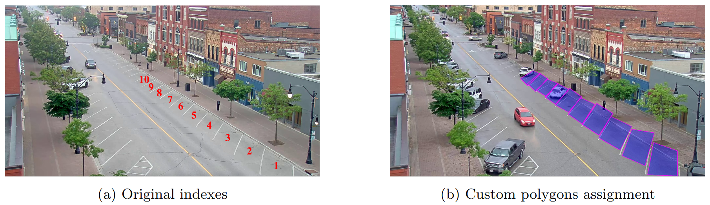

# Parking Lot Monitoring System

## Overview

The goal of this project is to develop an automatic system for video analysis that enables visual surveillance of on-street parking spaces for a particular scene. The system gets as input data the video stream from a static camera in a specific scene and is able to:

- Classify on-street parking spaces as being occupied or not given a video frame.
- Update configuration of parking spaces given the initial configuration and a video stream to process.
- Track a specific vehicle in the scene of a given video.

## Table of Contents

- [Key Features](#key-features)
- [Installation](#installation)
- [Usage](#usage)

## Key Features

### Real-time Parking Space Classification

The system automatically classifies on-street parking spaces in a video frame as either occupied or free. It uses custom-defined polygons and object detection techniques to achieve this classification.


### Dynamic Configuration Update

The system can dynamically update the configuration of parking spaces based on the initial setup and real-time video analysis. This allows for adaptive monitoring and management of parking availability.

### Vehicle Tracking

Using advanced object tracking algorithms, the system can track a specific vehicle across frames in a video feed. This capability enables detailed surveillance and monitoring of vehicle movements within the monitored scene.


## Installation

### Requirements

- python = "3.11"
- ultralytics = {git = "https://github.com/THU-MIG/yolov10.git"}
- shapely = "2.0.4"
- opencv-contrib-python = "4.10.0.84"
- huggingface-hub = "0.23.4"

### Steps

1. Clone the repository:

    ```bash
    git clone https://github.com/EdyStan/parking-lot-monitoring-system
    ```

2. Navigate to the project directory:

    ```bash
    cd parking-lot-monitoring-system
    ```

3. Install Poetry. Check out [this link](https://python-poetry.org/docs/).

4. Install the required dependencies present in `pyproject.toml`:

    ```bash
    poetry install
    ```

## Usage

The file used to run the project is `run_project.py`. You can configure the following variables:

1. `PROJECT_PATH` - the path where the project is stored on your computer.
2. `TASK{i}_PATH` - the directory from which you want to extract the images for task {i}.
3. `TASK{i}_OUTPUT_PATH` - the directory in which the results are written for task {i}.
4. `SHOW_DETAILS` - a boolean variable that specifies whether additional information will be generated during execution.

## Implementation

### Task 1: Parking Space Classification

The first task involves classifying on-street parking spaces as occupied or free. Custom polygons are defined to identify each parking space, as shown in the following examples:


*Figure 1: Unique parking lots identification using polygons.*


The system uses YOLO models for object detection and computes bounding boxes around vehicles in the scene. These bounding boxes are then checked against the defined polygons to determine occupancy.

### Task 2: Configuration Update

The second task updates the configuration of 10 on-street parking spaces based on initial settings and video data analysis. Here's an example of how the system processes and updates configurations, based on the model used:


*Figure 3: Comparison of different YOLO models.*

### Task 3: Vehicle Tracking

In the third task, the system tracks specific vehicles across video frames. An example showing the tracking of a vehicle at different time steps:


*Figure 4: Frames from a video with annotated vehicle tracking.*

